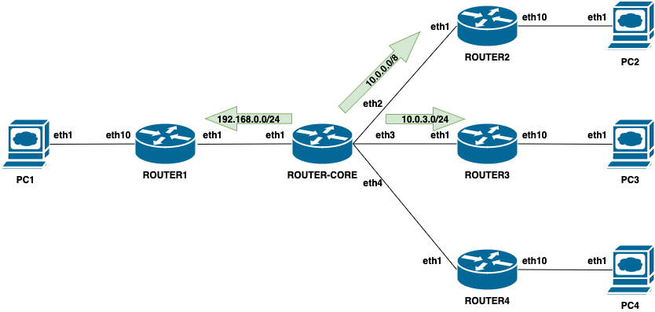

## Введение

В прошлой лабораторной работе вы уже научились работать с containerlab, знаете как заходить на устройства, настраивать frr и т.п.
Для выполнения это лабораторной по статической маршрутизации вам потребуется знание только одной дополнительной команды.
А если точнее, вам потребуется знать как добавить статический маршрут.
Для того что бы настроить в frr статический маршрут, вам достаточно перейти в конфигурационный режим устройства дав команду `conf t`
```
router-core# conf t
router-core(config)#
```

добавить статический маршрут в следующем формате
```
ip route <net/mask> <next-hop> , где

<net/mask> - сеть до которой вы хотите определить маршрут
<next-hop> - ip адрес устройства через которое эта сеть доступна
```

выйти из режима конфигурации и сохранить ее
```
router-core(config)# exit
router-core# wr
```

Суммируем. Допустим мы хотим добавить маршрут который будет вести нас до сети 10.0.0.0/8 через маршрутизатор с ip адресом 172.16.2.2.
Настройка будет выглядеть следующим образом
```
router-core# conf t
router-core(config)# ip route 10.0.0.0/8 172.16.2.2
router-core(config)# exit
router-core# wr
```

т.е мы заходим в режим конфигурации, добавляем статический маршрут, выходим из режима конфигурации и сохраняем конфигурацию в энергонезависимую память

Это все что нам нужно знать. Давайте переходить к описанию нашей исходной топологии и заданию

## Топология
Ниже представлена схема и таблица с ip адресами интерфейсов всех устройств нашей топологии.

В рамках данной схемы мы будем добавлять статические маршруты. 
Как видно на схеме ниже, на ROUTER-CORE мы: 
* добавим маршрут до сети за ROUTER2 широкой маской 10.0.0.0/8
* точный маршрут до сети 10.0.3.0/24 за ROUTER3
* точный маршрут до сети 192.168.0.0.24
* и **НЕ** будет добавлять маршрут до сети 10.0.4.0/24 находящейся за ROUTER4

Посмотрим что из этого получится и как у нас воспроизведется такая вещь как L3 петля.


```
 ───────────────┬───────────────────┬─────────────────────────╮
│   Router      │   Interface       │   IPv4 Address          │
├───────────────┼───────────────────┼─────────────────────────┤
│ router-core   │    eth1           │     172.16.1.1/24       │
├───────────────┼───────────────────┼─────────────────────────┤
│               │    eth2           │     172.16.2.1/24       │
├───────────────┼───────────────────┼─────────────────────────┤
│               │    eth3           │     172.16.3.1/24       │
├───────────────┼───────────────────┼─────────────────────────┤
│               │    lo0            │     172.16.4.1/24       │
├───────────────┼───────────────────┼─────────────────────────┤
│ router1       │    eth1           │     172.16.1.2/30       │
├───────────────┼───────────────────┼─────────────────────────┤
│               │    eth10          │     192.168.0.1/24      │
├───────────────┼───────────────────┼─────────────────────────┤
│  router2      │    eth1           │     172.16.2.2/30       │
├───────────────┼───────────────────┼─────────────────────────┤
│               │    eth10          │     10.0.2.1/24         │
├───────────────┼───────────────────┼─────────────────────────┤
│  router3      │    eth1           │     172.16.3.2/24       │
├───────────────┼───────────────────┼─────────────────────────┤
│               │    eth10          │     10.0.3.1/24         │
├───────────────┼───────────────────┼─────────────────────────┤
│  router4      │    eth1           │     172.16.4.2/24       │
├───────────────┼───────────────────┼─────────────────────────┤
│               │    eth10          │     110.0.4.1/24        │
├───────────────┼───────────────────┼─────────────────────────┤
│  PC1          │    eth1           │    192.168.0.2/24       │
├───────────────┼───────────────────┼─────────────────────────┤
│  PC2          │    eth1           │     10.0.2.2/24         │
├───────────────┼───────────────────┼─────────────────────────┤
│  PC3          │    eth1           │     10.0.3.2/24         │
├───────────────┼───────────────────┼─────────────────────────┤
│  PC4          │    eth1           │     10.0.4.2/24         │
╰───────────────┴───────────────────┴─────────────────────────╯

```
Вся топология описана в файле **`static_routing.yml`**, который используется для запуска

## Запускаем лабу

Если у вас еще не склонирован проект, то клонируем его

Идем в директорию нашей лабы
```
cd lab2
```
и запускаем
```
sudo ./start.sh
```
На выходе получаем такую картинку 
```
Учтите что containerlab добавляет `clab-<имя_файла_топологии>` в имя каждого устроства. Это важно помнить когда вы заходите на устройства.
╭─────────────────────────────────┬──────────────────────┬─────────┬────────────────╮
│               Name              │      Kind/Image      │  State  │ IPv4/6 Address │
├─────────────────────────────────┼──────────────────────┼─────────┼────────────────┤
│ clab-static-routing-PC1         │ linux                │ running │ N/A            │
│                                 │ alpine:latest        │         │ N/A            │
├─────────────────────────────────┼──────────────────────┼─────────┼────────────────┤
│ clab-static-routing-PC2         │ linux                │ running │ N/A            │
│                                 │ alpine:latest        │         │ N/A            │
├─────────────────────────────────┼──────────────────────┼─────────┼────────────────┤
│ clab-static-routing-PC3         │ linux                │ running │ N/A            │
│                                 │ alpine:latest        │         │ N/A            │
├─────────────────────────────────┼──────────────────────┼─────────┼────────────────┤
│ clab-static-routing-PC4         │ linux                │ running │ N/A            │
│                                 │ alpine:latest        │         │ N/A            │
├─────────────────────────────────┼──────────────────────┼─────────┼────────────────┤
│ clab-static-routing-router-core │ linux                │ running │ N/A            │
│                                 │ frrouting/frr:v7.5.1 │         │ N/A            │
├─────────────────────────────────┼──────────────────────┼─────────┼────────────────┤
│ clab-static-routing-router1     │ linux                │ running │ N/A            │
│                                 │ frrouting/frr:v7.5.1 │         │ N/A            │
├─────────────────────────────────┼──────────────────────┼─────────┼────────────────┤
│ clab-static-routing-router2     │ linux                │ running │ N/A            │
│                                 │ frrouting/frr:v7.5.1 │         │ N/A            │
├─────────────────────────────────┼──────────────────────┼─────────┼────────────────┤
│ clab-static-routing-router3     │ linux                │ running │ N/A            │
│                                 │ frrouting/frr:v7.5.1 │         │ N/A            │
├─────────────────────────────────┼──────────────────────┼─────────┼────────────────┤
│ clab-static-routing-router4     │ linux                │ running │ N/A            │
│                                 │ frrouting/frr:v7.5.1 │         │ N/A            │
╰─────────────────────────────────┴──────────────────────┴─────────┴────────────────
```
Мы готовы к выполнению задания


## Задание

В соответствие с заданной топологией, выполните настройку статических маршрутов на устройствах
* На маршрутизатор clab-static-routing-router-core добавьте маршруты:
    * до сети 10.0.0.0/8 через 172.16.2.2
    * до сети 10.0.3.0/24 через 172.16.3.2
    * до сети 192.168.0.0/24 через 172.16.1.2
* На маршрутизаторе clab-static-routing-router1 добавьте маршруты:
    * до сети 0.0.0.0/0 через 172.16.1.1
* На маршрутизаторе clab-static-routing-router2 добавьте маршруты:
    * до сети 0.0.0.0/0 через 172.16.2.1
* На маршрутизаторе clab-static-routing-router3 добавьте маршруты:
    * до сети 0.0.0.0/0 через 172.16.3.1
* На маршрутизаторе clab-static-routing-router4 добавьте маршруты:
    * до сети 0.0.0.0/0 через 172.16.4.1

## Проверяем что у нас получилось

Для проверки идем в шел на наш первый компьютер
```
$ docker exec -it clab-static-routing-PC1 /bin/sh
/ # 
```
Проверяем трассировку до PC2. Видно что она проходит успешно.
Не смотря на то, что мы не добавляли маршрут до сети 10.0.2.0/24, но у нас есть маршрут до 10.0.0.0/8, который ведет через 172.16.2.2.
При этом не нашлось более специфического маршрута и мы успешно добираемся до PC2 с PC1.
```
/ # traceroute -m 5 10.0.2.2
traceroute to 10.0.2.2 (10.0.2.2), 5 hops max, 46 byte packets
 1  192.168.0.1 (192.168.0.1)  0.004 ms  0.027 ms  0.002 ms
 2  172.16.1.1 (172.16.1.1)  0.002 ms  0.027 ms  0.002 ms
 3  172.16.2.2 (172.16.2.2)  0.002 ms  0.035 ms  0.002 ms
 4  10.0.2.2 (10.0.2.2)  0.001 ms  0.024 ms  0.002 ms
```

Трассировка до PC3 так же успешна. Маршрут до 10.0.3.0/24 сети через 172.16.3.2 отрабатывает успешно
```
/ # traceroute -m 5 10.0.3.2
traceroute to 10.0.3.2 (10.0.3.2), 5 hops max, 46 byte packets
 1  192.168.0.1 (192.168.0.1)  0.004 ms  0.093 ms  0.002 ms
 2  172.16.1.1 (172.16.1.1)  0.002 ms  0.025 ms  0.002 ms
 3  172.16.3.2 (172.16.3.2)  0.001 ms  0.026 ms  0.002 ms
 4  10.0.3.2 (10.0.3.2)  0.002 ms  0.022 ms  0.001 ms
```

А вот при попытки добрать до 10.0.4.2 мы столкнулись с таким явлением как L3 петля.
На трассировке ниже видно что путь зациклился между 172.16.1.1 и 172.16.2.2
```
/ # traceroute -m 5 10.0.4.2
traceroute to 10.0.4.2 (10.0.4.2), 5 hops max, 46 byte packets
 1  192.168.0.1 (192.168.0.1)  0.004 ms  0.025 ms  0.002 ms
 2  172.16.1.1 (172.16.1.1)  0.001 ms  0.025 ms  0.002 ms
 3  172.16.2.2 (172.16.2.2)  0.001 ms  0.025 ms  0.001 ms
 4  172.16.1.1 (172.16.1.1)  0.001 ms  0.025 ms  0.002 ms
 5  172.16.2.2 (172.16.2.2)  0.001 ms  0.025 ms  0.002 ms
 ```

Почему так произошло?
Если мы пройдемся по нашим маршрутизатором и попробуем отследить путь, то все станет понятно.
На 1-м маршрутизаторе у нас просто дефолт маршрут 0.0.0.0 через 172.16.1.1
Далее давайте посмотрим что у нас на ROUTER-CORE 
```
router-core# show ip route 10.0.4.2
Routing entry for 10.0.0.0/8
  Known via "static", distance 1, metric 0, best
  Last update 01w3d21h ago
  * 172.16.2.2, via eth2, weight 1
```
Видим что нет более специфичного маршрута чем 10.0.0.0/8 через 10.0.4.2 (напоминаю, добавить маршрут до 10.0.4.0/24 через ROUTER4 мы умышленно забыли)

Т.е. далее пакет попадает на ROUTER2. Давайте посмотрим что мы видим на ROUTER2
```
$ docker exec -it clab-static-routing-router2 vtysh

Hello, this is FRRouting (version 7.5.1_git).
Copyright 1996-2005 Kunihiro Ishiguro, et al.

router2# show ip route 10.0.4.2
Routing entry for 0.0.0.0/0
  Known via "static", distance 1, metric 0, best
  Last update 01w3d21h ago
  * 172.16.2.1, via eth1, weight 1

router2#
```
На ROUTER2 у нас только дефолт 0.0.0.0, который отправляет нас обратно на ROUTER-CORE.

Таким образом у нас образовалась L3 петля, и маршрутизаторы ROUTER-CORE и ROUTER2 будут перекидывать между собой этот пакет до тех пор пока не истечет TTL этого пакета

## Пушим наши результаты в репозиторий

Все готово. Коммитим свои изменения, пушим в ветку и ждем пока пройдут автотесты. Если тесты прошли, значит вы все выполнили правильно.