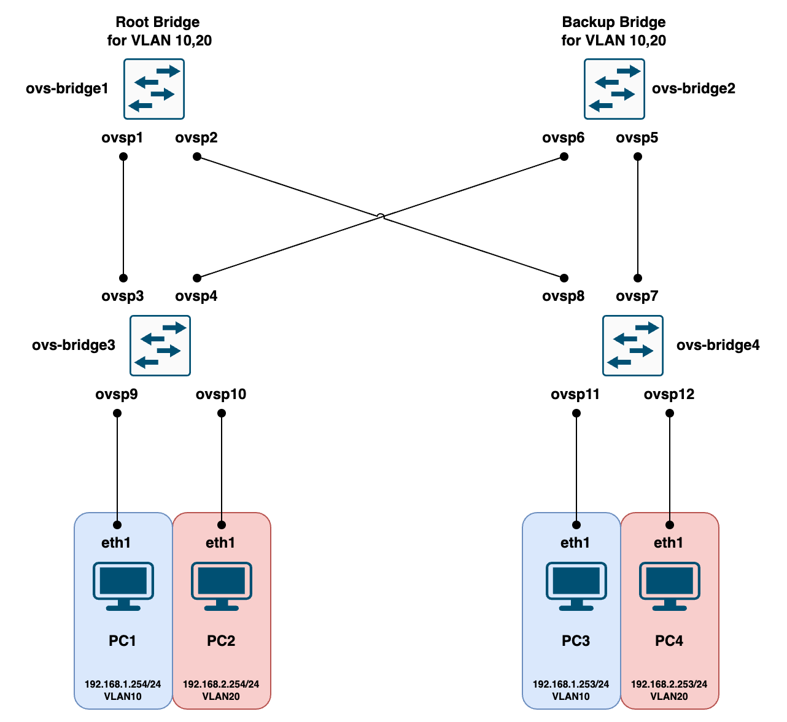

## Введение

В текущей лабороторной работе мы познакомимся с основами коммутации на сетевом оборудовании. Для получения практического необходимо собрать следующую топологию



## Шаг 1. Запускаем лабу

Запускаем скрипт и ожидаем автодеплоя топологии

```
sudo ./start.sh
```
Скрипт выполнит такие команды как:
* `sudo apt-get install openvswitch-switch` - скачиваем ovs
* `sudo ovs-vsctl add-br ovs-bridge#` - containerlab не умеет пораждать bridge, которые определены в yml файле. создаем самостоятельно
* `sudo ovs-vsctl set bridge ovs-bridge# stp_enable=true#` - на ovs по умолчанию выключен STP, но нам он нужен для экспериментов. Включаем
* `sudo clab deploy --topo switching.yml` - деплоим топологию отрисованую выше
* `./PC-interfaces.sh` - настраиваем IP Адреса на VM Alpine

Результатом выполнении shell скрипта будет таблица в CLI

```
╭────────────────────┬───────────────┬─────────┬───────────────────╮
│        Name        │   Kind/Image  │  State  │   IPv4/6 Address  │
├────────────────────┼───────────────┼─────────┼───────────────────┤
│ clab-switching-pc1 │ linux         │ running │ 172.20.20.2       │
│                    │ alpine:latest │         │ 3fff:172:20:20::2 │
├────────────────────┼───────────────┼─────────┼───────────────────┤
│ clab-switching-pc2 │ linux         │ running │ 172.20.20.3       │
│                    │ alpine:latest │         │ 3fff:172:20:20::3 │
├────────────────────┼───────────────┼─────────┼───────────────────┤
│ clab-switching-pc3 │ linux         │ running │ 172.20.20.4       │
│                    │ alpine:latest │         │ 3fff:172:20:20::4 │
├────────────────────┼───────────────┼─────────┼───────────────────┤
│ clab-switching-pc4 │ linux         │ running │ 172.20.20.5       │
│                    │ alpine:latest │         │ 3fff:172:20:20::5 │
╰────────────────────┴───────────────┴─────────┴───────────────────╯
```

Отсуствие ovs-bridge в таблице нормальное поведение containerlab, потому что при деплое топологии мы лишь создаем связи bridge <-> bridge, pc <-> bridge + создаем pc. Посмотреть созданные нами интерфейсы для ovs можно так:
```
sudo ovs-vsctl show
17b443dc-48b8-4d48-bc8d-f53bee1f8a78
    Bridge ovs-bridge3
        Port ovsp14
            Interface ovsp14
        Port ovsp13
            Interface ovsp13
        Port ovsp15
            Interface ovsp15
        Port ovsp16
            Interface ovsp16
        Port ovs-bridge3
            Interface ovs-bridge3
                type: internal
    Bridge ovs-bridge4
        Port ovsp11
            Interface ovsp11
        Port ovsp9
            Interface ovsp9
        Port ovsp10
            Interface ovsp10
        Port ovsp12
            Interface ovsp12
        Port ovs-bridge4
            Interface ovs-bridge4
                type: internal
    Bridge ovs-bridge2
        Port ovsp5
            Interface ovsp5
        Port ovs-bridge2
            Interface ovs-bridge2
                type: internal
        Port ovsp7
            Interface ovsp7
        Port ovsp6
            Interface ovsp6
        Port ovsp8
            Interface ovsp8
    Bridge ovs-bridge1
        Port ovsp3
            Interface ovsp3
        Port ovsp2
            Interface ovsp2
        Port ovsp1
            Interface ovsp1
        Port ovsp4
            Interface ovsp4
        Port ovs-bridge1
            Interface ovs-bridge1
                type: internal
```

## Шаг 2. Операционная часть

Давайте посмотрим на примеры команд, которыми мы будем пользоваться при выполнении нашей лабораторной работы

Перевести порт в нетегированный режим, а затем присвоить ему номер vlan
```
sudo ovs-vsctl set port ovsp1 vlan=access
sudo ovs-vsctl set port ovsp1 tag=10
```
Тегированные порты настраиваются похожим образом
```
sudo ovs-vsctl set port ovsp13 vlan=trunk
sudo ovs-vsctl set port ovsp13 trunks=10,20
```
Посмотреть STP топологию можно следующим образом
```
sudo ovs-appctl rstp/show
```
Определить STP приоритет у ovs-bridge можно так
```
sudo ovs-vsctl set bridge ovs-bridge1 other_config:rstp-priority=4096
```

## Шаг 3. Задание

1. На ovs-bridge3, ovs-bridge4 порты в сторону PC должны быть настроены согласно схемы в нетегированном режиме
2. Порты между всеми ovs-bridge настроены в тегированном режиме. Маска должна допускать только два vlan - 10,20
3. Root/Backup Bridge определяется ручным вмешательством человека. Для простоты будем использовать значение константы - root имеет stp-priority 4096, а backup 8192. ovs-bridge1 root bridge, ovs-bridge2 backup. 
Перед сменой приоритетов, хорошим тоном будем посмотреть какая топология была постороена автоматически, самим STP, а также после смены сравнить две топологии

## Шаг 4. Верификация

Для проверки всех наших изменений будет проверять связность между всеми PC. Сценарий должен быть следеюущим:

PC1 и PC3 имеют связность друг с другом, но не с PC2 и PC4. PC2 и PC4 имеют связность друг с другом, но изолированы от PC3 и PC1

Выполняем первую проверку:
```
sudo docker exec clab-switching-pc1 /bin/sh -c "ping 192.168.1.253"
PING 192.168.1.253 (192.168.1.253): 56 data bytes
64 bytes from 192.168.1.253: seq=0 ttl=64 time=1.136 ms
64 bytes from 192.168.1.253: seq=1 ttl=64 time=0.081 ms
64 bytes from 192.168.1.253: seq=2 ttl=64 time=0.079 ms
64 bytes from 192.168.1.253: seq=3 ttl=64 time=0.122 ms
```
Выполняем вторую проверку:
```
sudo docker exec clab-switching-pc2 /bin/sh -c "ping 192.168.2.253"
PING 192.168.2.253 (192.168.2.253): 56 data bytes
64 bytes from 192.168.2.253: seq=0 ttl=64 time=0.203 ms
64 bytes from 192.168.2.253: seq=1 ttl=64 time=0.079 ms
64 bytes from 192.168.2.253: seq=2 ttl=64 time=0.071 ms
64 bytes from 192.168.2.253: seq=3 ttl=64 time=0.107 ms
64 bytes from 192.168.2.253: seq=4 ttl=64 time=0.145 ms
```

В случае успеха ожидаем наличие связности, в противном случае ICMP ответов мы в выводе не увидим, что говорит о наличии ошибки в конфигурации.
Первым делом стоит проверить настроены порты в сторону PC, а потом уже между коммутаторами.

Перепроверить себя можно следующим образом:
```
sudo ovs-vsctl list port ovsp12
_uuid               : fc3d9f4f-eeb4-440a-a315-a96b556075d0
bond_active_slave   : []
bond_downdelay      : 0
bond_fake_iface     : false
bond_mode           : []
bond_updelay        : 0
cvlans              : []
external_ids        : {}
fake_bridge         : false
interfaces          : [9befa64f-7fb0-4353-baba-35c7b3fdc196]
lacp                : []
mac                 : []
name                : ovsp12
other_config        : {}
protected           : false
qos                 : []
rstp_statistics     : {rstp_error_count=0, rstp_rx_count=0, rstp_tx_count=1, rstp_uptime=7515}
rstp_status         : {rstp_designated_bridge_id="8.000.3e4da4352542", rstp_designated_path_cost="2000", rstp_designated_port_id="8003", rstp_port_id="8003", rstp_port_role=Designated, rstp_port_state=Forwarding}
statistics          : {}
status              : {}
tag                 : 10
trunks              : []
vlan_mode           : access
```
Команда отображает все возможные атрибуты порта. Тут нас интересуют такие поля как "tag", "vlan_mode". Исходя из результата команды можно понять, что порт работает в нетегированном режиме с VLAN под номером 10.
Настройки тегированных портов сильно не отличаются
```
sudo ovs-vsctl list port ovsp1
_uuid               : 96324e70-10a3-4e1f-856b-27e19e4b4289
bond_active_slave   : []
bond_downdelay      : 0
bond_fake_iface     : false
bond_mode           : []
bond_updelay        : 0
cvlans              : []
external_ids        : {}
fake_bridge         : false
interfaces          : [0a94ea5d-6515-4710-b439-816cead89d64]
lacp                : []
mac                 : []
name                : ovsp1
other_config        : {}
protected           : false
qos                 : []
rstp_statistics     : {rstp_error_count=0, rstp_rx_count=78, rstp_tx_count=0, rstp_uptime=7928}
rstp_status         : {rstp_designated_bridge_id="1.000.e69a34240e40", rstp_designated_path_cost="0", rstp_designated_port_id="8001", rstp_port_id="8001", rstp_port_role=Designated, rstp_port_state=Forwarding}
statistics          : {}
status              : {}
tag                 : []
trunks              : [10, 20]
vlan_mode           : trunk
```
В данном случае нас интересуют поля "trunks", "vlan_mode". Исходя из вывода мождно понять, что порт работает в тегированном режиме с маской VLAN 10-20

## Шаг 5. Отправка изменений на проверку
После выполнения всех пунктов задания необходимо запустить python скрипт data.py, который создаст новый файл command_results.json для последующей автоматической проверки. Теперь ваши изменения готовы для проверки, ветку можно пушить