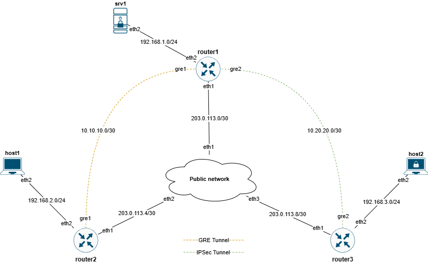

## Введение

В данной лабораторной работе мы поупражняемся с созданием туннелей с шифрованием и без. В отличии от других работ львиная часть настроек будет производиться в шелле докер контейнера. Связано это с тем, FRRouting это в первую очередь демон маршрутизации, и в работе с интерфейсами и каналами связи полагается на операционную систему.

## Важно. Подготовка окружения
#### ip_gre
Для успешного выполнения лабораторной работы, в ядро хост системы должен быть подгружен модуль ip_gre. Проверить это можно следующей командой:
```
denseven@noc-academy-lab:~$ lsmod | grep gre
ip_gre                 28672  0
ip_tunnel              32768  1 ip_gre
gre                    16384  1 ip_gre
```
Если вывод пустой, то подгрузим его так:
```
modprobe ip_gre
```
#### custom image
Так же для управления сетью, демонами и IPSec в контейнерах нам потребуется пара пакетов - openrc, strongswan. Для этого мы соберем кастомный образ на базе frrouting/frr:v7.5.1

Создаем файл Dockerfile со следующим содержимым:
```
FROM frrouting/frr:v7.5.1

CMD ["/bin/sh"]

RUN apk add strongswan --no-cache && apk add openrc
RUN mkdir -p /run/openrc/exclusive && touch /run/openrc/softlevel
```
Собираем его в образ с помощью команды:
```
docker build -t frrouting/frr:v7.5.1-lab4 .
```
Проверяем, что образ доступен:
```
denseven@noc-academy-lab:~$ docker images | grep lab4
frrouting/frr   v7.5.1-lab4   a6e691d31857   4 days ago    132MB

```
На этом подготовительная часть закончена

## Топология



## Запуск
Выполняем
```
./start.sh
```
### Задание 1. GRE туннель
В первом задании мы соберем GRE туннель без шифрования между router1 и router2. Помимо этого, должна быть, end-to-end связность между сетями в которых находится host1 и srv1
1. Подключаемся к router1. Для роутеров мы вольны выбирать между bash и sh в качестве шелла
```
docker exec -it clab-vpn-router1 bash
```
2. Создаем gre интерфейсы. Для alpine linux мы используем настройку сети через файл `/etc/network/interfaces`. Добавим следующие строки:

```
auto gre1
iface gre1 inet static
        address 10.10.10.1
        netmask 255.255.255.252
        pre-up ip tunnel add gre1 mode gre local 203.0.113.2 remote 203.0.113.6
        post-down ip tunnel del gre1
```
Где,
* `auto gre1` - пытаться поднять интерфейс при старте операционной системы
* `iface gre1 inet static` - создаем интерфей с именем `gre1` и статический адресацией
* `address` - ip адрес туннеля
* `netmask` - его маска, /30
*  `pre-up ip tunnel add gre1 mode gre local 203.0.113.2 remote 203.0.113.6` - описание туннеля gre1, mode/режим gre, local/remote - внешние адреса туннеля
*  `post-down ip tunnel del gre1` удалить специфичные настройки gre1 при отключении интерфейса
3. Применим наши изменения:
```
bash-5.1# rc-service networking restart
```
4. Проверим, что интерфейс появился в системе:
```
bash-5.1# ip addr show dev gre1
7: gre1@NONE: <POINTOPOINT,NOARP,UP,LOWER_UP> mtu 9476 qdisc noqueue state UNKNOWN group default qlen 1000
    link/gre 203.0.113.2 peer 203.0.113.6
    inet 10.10.10.1/30 scope global gre1
       valid_lft forever preferred_lft forever
    inet6 fe80::cb00:7102/64 scope link
       valid_lft forever preferred_lft forever
```
5. Аналогично router1, производим настройку router2. Для этого мы повторяем пункты 1-4. Внимательно задаем адреса и имена интерфейсов, используя схему из топологии
6. На этом этапе настройка туннеля закончена. Проверим доступность router1 c router2 по внутреннему адресу его интерфейса:
```
bash-5.1# ip addr show dev gre1 | grep inet
    inet 10.10.10.2/30 scope global gre1
    inet6 fe80::cb00:7106/64 scope link
bash-5.1# ping -c1 10.10.10.1
PING 10.10.10.1 (10.10.10.1): 56 data bytes
64 bytes from 10.10.10.1: seq=0 ttl=64 time=0.191 ms

--- 10.10.10.1 ping statistics ---
1 packets transmitted, 1 packets received, 0% packet loss
round-trip min/avg/max = 0.191/0.191/0.191 ms
```
7. Однако если мы проверим связность между host1 и srv1, то заметим ее отсутствие. Дело в том что базовая конфигурация содержит статические маршруты до роутеров, но не до сетей которые они терминируют. Исправим это:
```
# Подключимся к router1
docker exec -it clab-vpn-router1 vtysh
# Добавим маршрут
router1# conf t
router1(config)#ip route 192.168.2.0/24 10.10.10.2
router1(config)# exit
# Проверим маршрут в таблице
router1# sh ip route 192.168.2.0/24
Routing entry for 192.168.2.0/24
  Known via "static", distance 1, metric 0, best
  Last update 01:06:55 ago
  * 10.10.10.2, via gre1, weight 1
# Не забудем сохранить, если результат нас устраивает
router1# write
```
8. Добавим аналогичный маршрут на router2, но для сети 192.168.1.0/24. Обратите внимание, что в качестве nexthop'а мы указываем внутренний адрес gre туннеля

9. Проверим теперь доступность srv1
```
denseven@noc-academy-lab:$ docker exec -it clab-vpn-host1 sh
/ # ping -c4 192.168.1.1
PING 192.168.1.1 (192.168.1.1): 56 data bytes
64 bytes from 192.168.1.1: seq=0 ttl=62 time=0.711 ms
64 bytes from 192.168.1.1: seq=1 ttl=62 time=0.144 ms
64 bytes from 192.168.1.1: seq=2 ttl=62 time=0.104 ms
64 bytes from 192.168.1.1: seq=3 ttl=62 time=0.107 ms

--- 192.168.1.1 ping statistics ---
4 packets transmitted, 4 packets received, 0% packet loss
round-trip min/avg/max = 0.104/0.266/0.711 ms
```
### Задание 2. GRE over IPSec туннель
Во второй части лабораторной работы нам необходимо защитить данные, которые мы передаем между host2 и srv1. Для формирования туннеля, в дополнении к протоколу GRE, мы воспользуемся IPSec. Управлять конфигурацией и runtime работой туннеля мы будем с помощью пакета strongswan, который мы добавили в процессе подготовки к лабораторной работе

1. Сначала мы соберем gre туннель аналогичный описанному в задании 1, только между router1 и router3. Так же не забудем добавить статические маршруты до сетей 192.168.1.0/24 и 192.168.3.0/24. Для референса используйте шаги 1- 9 из предыдущего задания. В результате у Вас должна быть связность между srv1 и host1
```
denseven@noc-academy-lab:$ docker exec -it clab-vpn-host2 sh -c "ping -c4 192.168.1.1"
PING 192.168.1.1 (192.168.1.1): 56 data bytes
64 bytes from 192.168.1.1: seq=0 ttl=62 time=2.501 ms
64 bytes from 192.168.1.1: seq=1 ttl=62 time=0.196 ms
64 bytes from 192.168.1.1: seq=2 ttl=62 time=0.176 ms
64 bytes from 192.168.1.1: seq=3 ttl=62 time=0.160 ms

--- 192.168.1.1 ping statistics ---
4 packets transmitted, 4 packets received, 0% packet loss
round-trip min/avg/max = 0.160/0.758/2.501 ms
denseven@noc-academy-lab:~/noc-academy-2025/lab4_resolved$
```
2. Однако на этом этапе наш трафик не шифруется, и его легко можно перехватить на роутере public-network, который у нас изображает публичную сеть, eg Интернет. Поэтому мы будем заворачивать весь наш gre трафик между router1 и router3 в IPSec. Strongswan хранит основную часть настроек соединения в файле `/etc/swanctl/swanctl.conf`, давайте внесем в этот файл нашу конфигурацию, начнем с router1:
```
bash-5.1# cat /etc/swanctl/swanctl.conf
authorities {
}

pools {
}

connections {
        router3_ike {
                version         = 2
                mobike          = no
                proposals       = aes256-sha384-modp4096
                local_addrs     = 203.0.113.2
                local {
                        auth    = psk
                        id      = router1
                }
                remote_addrs    = 203.0.113.10
                remote {
                        auth    = psk
                        id      = router3
                }
                children {
                        router3_esp {
                                start_action    = trap
                                esp_proposals   = aes256gcm16-sha512-modp4096
                                mode            = transport
                                local_ts        = dynamic[gre]
                                remote_ts       = dynamic[gre]
                        }
                }
        }
}

secrets {
        ike-1 {
                id-router1      = router1
                id-router3      = router3
                secret          = psk-is-very-weak!
        }
}
```
Здесь,
* Секция **connections** содержит описание IKE соединений, в нашем случае router3_ike. Рассмотрим основные настройки
  * **local_add**, **remote_addr** - эндпоинты туннеля, адреса с которого и на который мы будем собирать IPSec туннель
  * **proposals = aes256-sha384-modp4096** Набор алгоритмов шифрования, проверки целостности и dh группа, которые позволено использовать демону для использования при установке соединения
  * **local {auth, id}, remote {auth, id}** - подсекции, в которых мы указываем тип аутентификации для эндпоинта и ссылку на его идентификатор
  * **children** - список SA(Security Associations) - которые будут порождены данным IKE, в нашем случае это только `router3_esp`
  * **start_action = trap** Действие, которое будет произведено после загрузки конфигурации. В нашем случае, демон будет пытаться установить соединение, только после того как будет детектирован трафик попадающий под селектор, о котором ниже
  * **esp_proposals = aes256gcm16-sha512-modp4096** набор алгоритмов для использования
  * **mode = transport** режим работы
  * **local_ts**, **remote_ts** селектор трафика, который попадает под действие SA/SP.
* Секция **secrets** здесь хранятся секреты
  *  **id-router1 = router1** матчер идентификатора связывающий объект в connections/secrets
  *  **secret = sk-is-very-weak!** - pre shared key, пароль для аутентификации эндпоинтов

Внимание отступы в синтаксисе важны, ориентируйтесь на пример при заполение файла 

3. После этого нужно подгрузить созданную конфигурацию в рантайм командой. В результате мы должны увидеть, что соединение успешно загружено
```
bash-5.1# swanctl --load-all
loaded ike secret 'ike-1'
no authorities found, 0 unloaded
no pools found, 0 unloaded
loaded connection 'router3_ike'
successfully loaded 1 connections, 0 unloaded
```
4. После настройки router1, необходимо повторить пункты 4-5 для router3. Меняются только имена IKE и SA а так же local_addrs, remote_addrs и id местами
5. На это этапе настройка IPSec завершена. Проверим связность между host2 и srv1:
```
denseven@noc-academy-lab:$ docker exec -it clab-vpn-host2 sh -c "ping -c4 192.168.1.1"
PING 192.168.1.1 (192.168.1.1): 56 data bytes
64 bytes from 192.168.1.1: seq=0 ttl=62 time=1.071 ms
64 bytes from 192.168.1.1: seq=1 ttl=62 time=0.184 ms
64 bytes from 192.168.1.1: seq=2 ttl=62 time=0.150 ms
64 bytes from 192.168.1.1: seq=3 ttl=62 time=0.153 ms
```
Хмм, почему такая задержка для первого пакета?

6. Мы успешно получаем ответы по icmp, однако как нам удостоверится, что наш трафик защищен? Здесь нам может помочь tcpdump на public-network. Ставим пакет
```
bash-5.1# apk add tcpdump
fetch https://dl-cdn.alpinelinux.org/alpine/v3.13/main/x86_64/APKINDEX.tar.gz
fetch https://dl-cdn.alpinelinux.org/alpine/v3.13/community/x86_64/APKINDEX.tar.gz
(1/2) Installing libpcap (1.10.0-r0)
(2/2) Installing tcpdump (4.99.0-r0)
Executing busybox-1.32.1-r5.trigger
OK: 110 MiB in 47 packages
```
7. Запускаем еще одну сессию до хоста с которого выполняется лабораторная работа (если умеете пользоваться screen, можно воспользоваться им). Мы делаем это для того, чтоб у нас была возможность, одновременно и послать icmp запросы поочередно до host1, host2 и при этом активно записывать трафик на public-network
   
Здесь мы отправляем icmp запросы
```
denseven@noc-academy-lab:~$ docker exec -it clab-vpn-srv1 sh -c "ping -c2 192.168.2.1"
PING 192.168.2.1 (192.168.2.1): 56 data bytes
64 bytes from 192.168.2.1: seq=0 ttl=62 time=0.302 ms
64 bytes from 192.168.2.1: seq=1 ttl=62 time=0.137 ms
--- 192.168.2.1 ping statistics ---
2 packets transmitted, 2 packets received, 0% packet loss
round-trip min/avg/max = 0.137/0.219/0.302 ms
denseven@noc-academy-lab:~$ docker exec -it clab-vpn-srv1 sh -c "ping -c2 192.168.3.1"
PING 192.168.3.1 (192.168.3.1): 56 data bytes
64 bytes from 192.168.3.1: seq=0 ttl=62 time=0.259 ms
64 bytes from 192.168.3.1: seq=1 ttl=62 time=0.131 ms
--- 192.168.3.1 ping statistics ---
2 packets transmitted, 2 packets received, 0% packet loss
round-trip min/avg/max = 0.131/0.195/0.259 ms
denseven@noc-academy-lab:~$ ^C

```
А вот, что мы видим в транзитной точке
```
bash-5.1# tcpdump -eni eth1 'host 203.0.113.2'
tcpdump: verbose output suppressed, use -v[v]... for full protocol decode
listening on eth1, link-type EN10MB (Ethernet), snapshot length 262144 bytes
17:41:56.422850 aa:c1:ab:34:9a:fc > aa:c1:ab:9b:68:a5, ethertype IPv4 (0x0800), length 122: 203.0.113.2 > 203.0.113.6: GREv0, proto IPv4 (0x0800), length 88: 192.168.1.1 > 192.168.2.1: ICMP echo request, id 21, seq 0, length 64
17:41:56.422950 aa:c1:ab:9b:68:a5 > aa:c1:ab:34:9a:fc, ethertype IPv4 (0x0800), length 122: 203.0.113.6 > 203.0.113.2: GREv0, proto IPv4 (0x0800), length 88: 192.168.2.1 > 192.168.1.1: ICMP echo reply, id 21, seq 0, length 64
17:41:57.423753 aa:c1:ab:34:9a:fc > aa:c1:ab:9b:68:a5, ethertype IPv4 (0x0800), length 122: 203.0.113.2 > 203.0.113.6: GREv0, proto IPv4 (0x0800), length 88: 192.168.1.1 > 192.168.2.1: ICMP echo request, id 21, seq 1, length 64
17:41:57.423794 aa:c1:ab:9b:68:a5 > aa:c1:ab:34:9a:fc, ethertype IPv4 (0x0800), length 122: 203.0.113.6 > 203.0.113.2: GREv0, proto IPv4 (0x0800), length 88: 192.168.2.1 > 192.168.1.1: ICMP echo reply, id 21, seq 1, length 64
17:42:01.637608 aa:c1:ab:9b:68:a5 > aa:c1:ab:34:9a:fc, ethertype ARP (0x0806), length 42: Request who-has 203.0.113.2 tell 203.0.113.1, length 28
17:42:01.637670 aa:c1:ab:34:9a:fc > aa:c1:ab:9b:68:a5, ethertype ARP (0x0806), length 42: Request who-has 203.0.113.1 tell 203.0.113.2, length 28
17:42:01.637739 aa:c1:ab:9b:68:a5 > aa:c1:ab:34:9a:fc, ethertype ARP (0x0806), length 42: Reply 203.0.113.1 is-at aa:c1:ab:9b:68:a5, length 28
17:42:01.637730 aa:c1:ab:34:9a:fc > aa:c1:ab:9b:68:a5, ethertype ARP (0x0806), length 42: Reply 203.0.113.2 is-at aa:c1:ab:34:9a:fc, length 28
17:42:02.629932 aa:c1:ab:34:9a:fc > aa:c1:ab:9b:68:a5, ethertype IPv4 (0x0800), length 158: 203.0.113.2 > 203.0.113.10: ESP(spi=0xcee2a035,seq=0x5), length 124
17:42:02.630045 aa:c1:ab:9b:68:a5 > aa:c1:ab:34:9a:fc, ethertype IPv4 (0x0800), length 158: 203.0.113.10 > 203.0.113.2: ESP(spi=0xc699c6fd,seq=0x5), length 124
17:42:03.630192 aa:c1:ab:34:9a:fc > aa:c1:ab:9b:68:a5, ethertype IPv4 (0x0800), length 158: 203.0.113.2 > 203.0.113.10: ESP(spi=0xcee2a035,seq=0x6), length 124
17:42:03.630241 aa:c1:ab:9b:68:a5 > aa:c1:ab:34:9a:fc, ethertype IPv4 (0x0800), length 158: 203.0.113.10 > 203.0.113.2: ESP(spi=0xc699c6fd,seq=0x6), length 124
^C
12 packets captured
12 packets received by filter
```
8. В дампе наглядно видно, что первые 4 пакета были распознаны, как GRE. Более того tcpdump, также показал заголовки под GRE раскрыв конечный протокол, источник и назначение пакетов. Последние 4 пакета в примере проходил по защищеному IPSec туннелю, и об этом трафике мы может только сказать что это ESP

## Проверка
Перед пушем выполненной лабораторной работы, можно проверить себя. Для этого запустите скрипт `check.py` командой из примера ниже. В случае успеха, вы увидите такой вывод:

```
denseven@noc-academy-lab:$ python3 check.py

GRE interface check
===================
Iface gre1 was found in runtime configuration on clab-vpn-router1
Iface gre1 was found in runtime configuration on clab-vpn-router2
Iface gre2 was found in runtime configuration on clab-vpn-router1
Iface gre2 was found in runtime configuration on clab-vpn-router3

ICMP check
===================
192.168.2.1 succesfully response with %0 losses
192.168.3.1 succesfully response with %25 losses

IPSec check
===================
IPSec IKE and SA successfully formed
IKE_SAs: 1 total, 0 half-open
```
Если же в работе найдутся ошибки, скрипт выпадет в traceback с исключением, в котором будет подсказка
```
denseven@noc-academy-lab:$ python3 check.py

GRE interface check
===================
ifconfig: gre1: error fetching interface information: Device not found
Traceback (most recent call last):
  File "/home/denseven/noc-academy-2025/lab4_clear/check.py", line 44, in <module>
    gre_check("gre1",["clab-vpn-router1", "clab-vpn-router2"])
  File "/home/denseven/noc-academy-2025/lab4_clear/check.py", line 15, in gre_check
    raise Exception (f"Iface {iface} was NOT found in runtime configuration on {item}")
Exception: Iface gre1 was NOT found in runtime configuration on clab-vpn-router1
```

