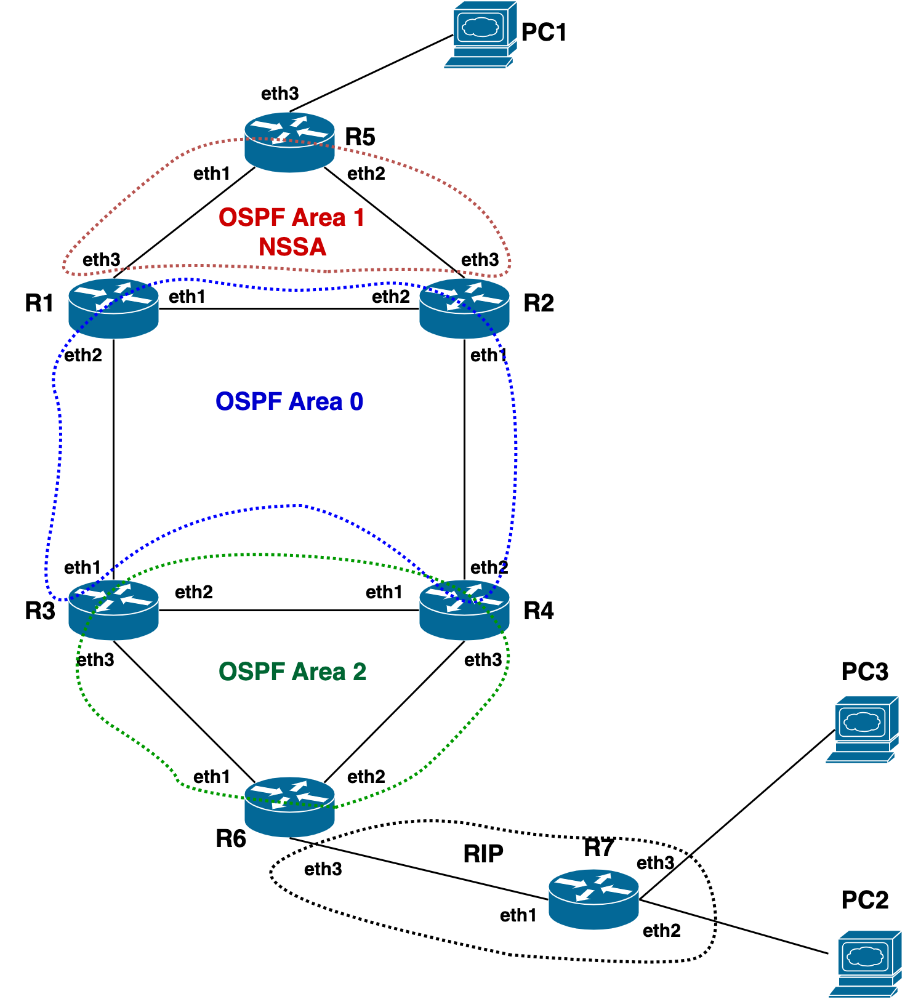

## Введение
Эта лабораторная работа будет посвящена протоколу динамической маршрутизации OSPF. В лабораторной работе вы познакомитесь с различными типами OSPF Area, механизмами редистрибуции внешних, о отношению к протоколу OSPF, маршрутов, механизмом аутентификации пиров, а также научитесь управлять трафикаом.
В данной лабораторной работе, также будет использоваться протокол RIP, с помошью которого будет проиллюстрирован процесс редистрибуции внешних маршрутов. Базовые настройки этого протокола уже будут преднастроены, также как и IP адреса на интерфейсах топологии.
Команды необходимые для выполнения данной лабораторной работы будут в описании заданий.

## Топология


```
╭───────────────┬───────────────────┬─────────────────────────╮
│   Router      │   Interface       │   IPv4 Address          │
├───────────────┼───────────────────┼─────────────────────────┤
│ router1       │    eth1           │     10.0.112.1/24       │
├───────────────┼───────────────────┼─────────────────────────┤
│               │    eth2           │     10.0.113.1/24       │
├───────────────┼───────────────────┼─────────────────────────┤
│               │    eth3           │     10.0.115.1/24       │
├───────────────┼───────────────────┼─────────────────────────┤
│               │    lo0            │     192.168.10.1/32     │
├───────────────┼───────────────────┼─────────────────────────┤
│ router2       │    eth1           │     10.0.124.2/24       │
├───────────────┼───────────────────┼─────────────────────────┤
│               │    eth2           │     10.0.112.2/24       │
├───────────────┼───────────────────┼─────────────────────────┤
│               │    eth3           │     10.0.125.2/24       │
├───────────────┼───────────────────┼─────────────────────────┤
│               │    lo0            │     192.168.10.2/32     │
├───────────────┼───────────────────┼─────────────────────────┤
│  router3      │    eth1           │     10.0.113.3/24       │
├───────────────┼───────────────────┼─────────────────────────┤
│               │    eth2           │     10.0.134.3/24       │
├───────────────┼───────────────────┼─────────────────────────┤
│               │    eth3           │     10.0.136.3/24       │
├───────────────┼───────────────────┼─────────────────────────┤
│               │    lo0            │     192.168.10.3/32     │
├───────────────┼───────────────────┼─────────────────────────┤
│  router4      │    eth1           │     10.0.134.4/24       │
├───────────────┼───────────────────┼─────────────────────────┤
│               │    eth2           │     10.0.124.4/24       │
├───────────────┼───────────────────┼─────────────────────────┤
│               │    eth3           │     10.0.146.4/24       │
├───────────────┼───────────────────┼─────────────────────────┤
│               │    lo0            │     192.168.10.4/32     │
├───────────────┼───────────────────┼─────────────────────────┤
│  router5      │    eth1           │     10.0.115.5/24       │
├───────────────┼───────────────────┼─────────────────────────┤
│               │    eth2           │     10.0.125.5/24       │
├───────────────┼───────────────────┼─────────────────────────┤
│               │    eth3           │     192.168.1.1/24      │
├───────────────┼───────────────────┼─────────────────────────┤
│               │    lo0            │     192.168.10.5/32     │
├───────────────┼───────────────────┼─────────────────────────┤
│  router6      │    eth1           │     10.0.136.6/24       │
├───────────────┼───────────────────┼─────────────────────────┤
│               │    eth2           │     10.0.146.6/24       │
├───────────────┼───────────────────┼─────────────────────────┤
│               │    eth3           │     10.0.167.6/24       │
├───────────────┼───────────────────┼─────────────────────────┤
│               │    lo0            │     192.168.10.6/32     │
├───────────────┼───────────────────┼─────────────────────────┤
│  router7      │    eth1           │     10.0.167.7/24       │
├───────────────┼───────────────────┼─────────────────────────┤
│               │    eth2           │     192.168.2.1/24      │
├───────────────┼───────────────────┼─────────────────────────┤
│               │    eth3           │     192.168.3.1/24      │
├───────────────┼───────────────────┼─────────────────────────┤
│               │    lo0            │     192.168.10.7/32     │
╰───────────────┴───────────────────┴─────────────────────────╯
```
Вся топология описана в файле ospf_lab.yml, который используется для запуска

## Запускаем лабу
Если у вас еще не склонирован проект, то клонируем его

Идем в директорию нашей лабы
```
cd lab5
```
и запускаем
```
sudo ./start.sh
```
На выходе получаем такую картинку 

Учтите что containerlab добавляет `clab-<имя_файла_топологии>` в имя каждого устроства. Это важно помнить когда вы заходите на устройства.


## Задание 1. Базовая настройка протокола OSPF в Area0
Для выполнения этого задания вам понадобится команда ```network``` с указанием сети номером Area, этой командой включается протол OSPF на интерaейсе. Важный момент что нужно указать именно адрес сети используемой на интерфейсе. Пример:
```
router ospf
 network 10.0.23.0/24 area 0
```
Router-id задается командой:
```
router ospf
 ospf router-id 192.168.10.100
```
 - Настройте протокол OSPF в Area0 согласно схеме (R1: eth1,eth2; R2: eth1,eth2; R3: eth1; R4: eth2), в качестве ospf router-id нужно использовать адресс lo0 интерфейса соответсвующего роутера.
 - Проанонсируйте lo0 интерфейсы всех маршрутизаторов зоны в OSPF протоол. Используйте для этого команду ```network``` из примера выше.
 - C помошью команды ```show ip ospf neighbor``` убедитесь что соседство установилось между заданными маршрутизаторами. 

## Задание 2. Базовая настройка протокола OSPF в Area1
В этом задании вам понадобится объявить Area1 как NSSA, для этого используется следующая команда:
```
router ospf
 area 1 nssa
```
 - Настройте протокол OSPF в Area1 согласно схеме (R1: eth3; R2:eth3; R5:eth1,eth2), в качестве ospf router-id нужно использовать адресс lo0 интерфейса соответсвующего роутера. 
 - Проанонсируйте lo0 интерфейс router5 в OSPF протоол.
 - Area 1 NSSA
 - C помошью команды ```show ip ospf neighbor``` убедитесь что соседство установилось между заданными маршрутизаторами. 

## Задание 3. Area1: аутентификация.
Аутентификация для протокола OSPF включается в 2 этапа.
1. Нужно включить аутентификацию глобально в протоколе OSPF для заданной area:
```
router ospf
 area 1 authentication message-digest
 ```
 2. Нужно включить аутентификацию на конкретном интерфейсе:
 ```
 interface eth3
 ip ospf authentication message-digest
 ip ospf message-digest-key 1 md5 PASSWORD
 ```
 Чтобы все работало корректно, аутентификация должна быть настроена с обеих сторон линка.
 - Настройте MD5 аутентификацию в Area1, пароль frr_deamon на всех соседствах внутри Area1.
 - C помошью команды "show ip ospf neighbor" убедитесь что соседство установилось между заданными маршрутизаторами после включения аутнтификации.

## Задание 4. Area1: ограничение распространения маршрутов из BB Area0
Для ограничения распространения Summary маршрутов используется команда:
```
router ospf
 area 1 nssa no-summary
```
 - Проверьте какие маршруты протокола OSPF есть на маршрутизаторе router5 командой "show ip route ospf". При условии правильного выполнения предыдущих пунктов, вы должны получть все маршруты из Area0, а также дефолтный маршрут.
 - Сделайте так чтобы в Area1 распространялся только маршрута по умолчанию из Area0.
 - C помошью команды "show ip ospf neighbor" убедитесь что соседство установилось между заданными маршрутизаторами после всех манипуляций.
 - Проверьте что в выводе "show ip route ospf" на маршрутизаторе router5 пропали все маршруты из Area0 кроме маршрута по умолчанию и directly connected сетей.

## Задание 5. Area1: редистрибуция внешних маршрутов.
Редистрибуция маршрутов в протокол OSPF выполняется командой ```redistribute``` в секции конфигурации ```router ospf```.
  - На маршрутизаторе router5 есть directly connected сеть 192.168.1.0/24, проанонсируйте ее в протокол OSPF с помошью LSA7.
  - Проверьте что в выводе "show ip route ospf" на маршрутизаторах router1 и router2 появился маршрут до этой сети.

## Задание 6. Базовая настройка протокола OSPF в Area2
 - Настройте протокол OSPF в Area2 согласно схеме (R3: eth2,eth3; R4: eth1,eth3; R6: eth1, eth2), в качестве ospf router-id нужно использовать адресс lo0 интерфейса соответсвующего роутера. 
 - Проанонсируйте lo0 интерфейс router6 в OSPF протоол.

## Задание 7. Area2: Редистрибуция маршрутов в протокол RIP
 - Сделайте редистрибуцию connected маршрутов, а также маршрутов протокола OSPF в протокол RIP
 - Для этого выполните следующие команды на маршрутизаторе router6:
```
router rip
 redistribute ospf
 redistribute connected
```
 - проверьте что на маршрутизаторе router7 появились новые маршруты. В таблице маршрутизауии должны появится маршруты всех lo а также стыковочные сети. Для проверки можно использовать команду ```show ip route```

## Задание 8. Area2: Редистрибуция маршрутов протокола RIP в протокол OSPF
При редистрибуции маршрутов из других протоколов, мы имеем возможность контролировать какие именно маршруты мы хотим импортировать. Один из способов это сделать, написать Access-list (ACL) с нужными сетями, описать действия в route-map и применить ее при редистрибуции.
ACL оперирует сетями, записанными с обратной маской для сети /24 обратная маска будет 0.0.0.255, для префикса /32 -> 0.0.0.0
Пример ACL разрешающий 2 префикса:
```
access-list TEST_ACL seq 5 permit 192.168.200.0 0.0.0.255
access-list TEST_ACL seq 5 permit 192.168.300.0 0.0.0.255
```
В случае если нам надо что-то запретить, вместо ```permit``` используется ```deny```.
Пример route-map которая использует этот ACL:
```
route-map TEST_RM_via_ACL permit 1
 match ip address TEST_ACL
```
При редистрибуции маршрутов нужно указать с помошью какой route-map нужно это сделать ```redistribute rip route-map TEST_RM_via_ACL```

 - на маршрутизаторе router6 сейчас есть 3 маршрута протокола rip к сетям 192.168.2.0/24, 192.168.3.0/24, 192.168.10.7/32. Убедитесь в этом выполнив команду "show ip route rip"
 - необходимо сделать редистрибуцию протокола rip таким образом чтобы импортировать в протокол OSPF только 2 сети: 192.168.2.0/24 и 192.168.10.7/32
 - для этого нужно написать access-list c этими сетями, использовать его в route-map и применить ее при редистрибуции, по аналогии с примером выше.
 - после выполнения задания убедитесь что маршруты на заданные сети появились в таблице маршрутизации, например на router1 (```show ip route```). В тоже время в ней не должно быть маршрута к сети 192.168.3.0/24 которая не входит в access-list.

## ШЗаданиеаг 9. Проверка связности.
 - выполните команду "ping 192.168.2.1" на маршрутизаторе router5. При условии правильного выполнения заданий выше, ping должен пройти.

## Задание 10. Управление трафиком.
Управлять стоимостью интерфейсов в протоколе OSPF можно в контексте конфигурации интерфейса, пример команды которая меняет OSPF cost:
```
interface eth3
 ip ospf cost 100
```
  - на маршрутизаторе router5 проверьте куда указывает маршрут по умолчанию. Должно быть 2 маршрута с одинаковой метрикой через:
```
      router5# show ip route 0.0.0.0
      Routing entry for 0.0.0.0/0
      Known via "ospf", distance 110, metric 11, best
      Last update 01:27:02 ago
      * 10.0.115.1, via eth1, weight 1
      * 10.0.125.2, via eth2, weight 1
```
  - сделайте так чтобы маршрут через интерфейс eth2 выигрывал. OSPF стоимость интерфейса можно посмотреть в выводе ```show ip ospf interface eth*```
  - убедитесь что в выводе ```show ip route 0.0.0.0``` остался один маршрут через eth2.
  - выполните команду ```traceroute 192.168.2.1```, убедитесь что трафик идет через eth2.

## Пушим наши результаты в репозиторий

Все готово. Коммитим свои изменения, пушим в ветку и ждем пока пройдут автотесты. Если тесты прошли, значит вы все выполнили правильно.