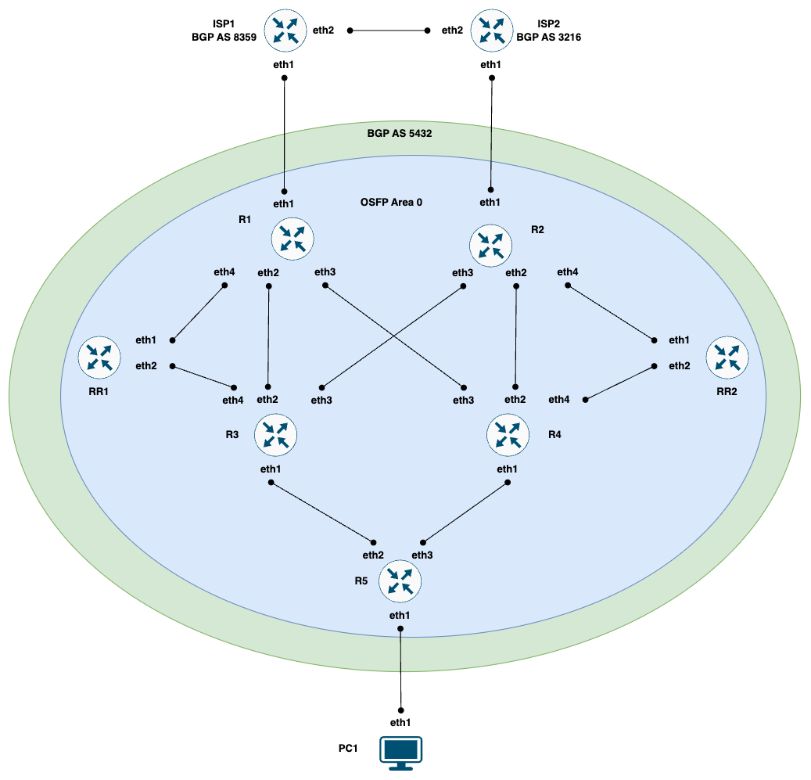
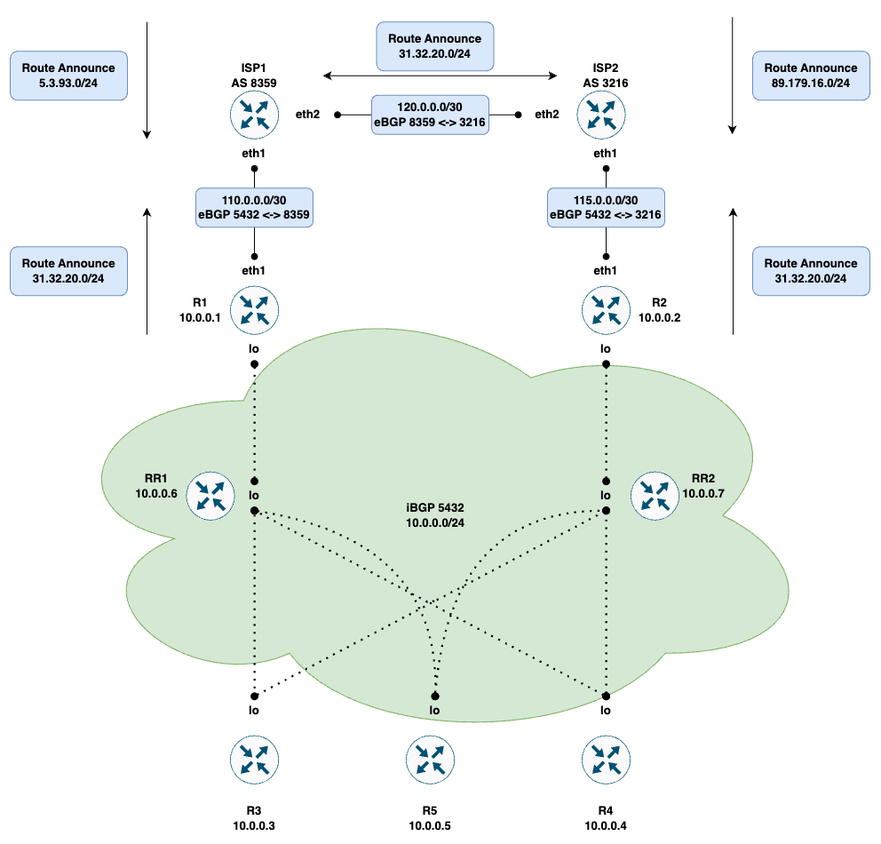

## Введение

В текущей лабороторной работе мы познакомимся с основами протокола маршрутизации BGP. Для получения практического необходимо собрать следующую топологию



## Шаг 1. Запускаем лабу

Запускаем скрипт и ожидаем автодеплоя топологии

```
sudo ./start.sh
```
Скрипт выполнит такие команды как:
* `sudo clab deploy --topo bgp.yml` - деплоим топологию отрисованую выше
* `./PC-interfaces.sh` - настраиваем IP Адреса на VM Alpine
```
╭─────────────────┬─────────────────────────────────┬─────────┬───────────────────╮
│       Name      │            Kind/Image           │  State  │   IPv4/6 Address  │
├─────────────────┼─────────────────────────────────┼─────────┼───────────────────┤
│ clab-bgp-ISP1   │ linux                           │ running │ N/A               │
│                 │ frrouting/frr:v7.5.1            │         │ N/A               │
├─────────────────┼─────────────────────────────────┼─────────┼───────────────────┤
│ clab-bgp-ISP2   │ linux                           │ running │ N/A               │
│                 │ frrouting/frr:v7.5.1            │         │ N/A               │
├─────────────────┼─────────────────────────────────┼─────────┼───────────────────┤
│ clab-bgp-PC1    │ linux                           │ running │ 172.20.20.3       │
│                 │ praqma/network-multitool:latest │         │ 3fff:172:20:20::3 │
├─────────────────┼─────────────────────────────────┼─────────┼───────────────────┤
│ clab-bgp-R1     │ linux                           │ running │ N/A               │
│                 │ frrouting/frr:v7.5.1            │         │ N/A               │
├─────────────────┼─────────────────────────────────┼─────────┼───────────────────┤
│ clab-bgp-R2     │ linux                           │ running │ N/A               │
│                 │ frrouting/frr:v7.5.1            │         │ N/A               │
├─────────────────┼─────────────────────────────────┼─────────┼───────────────────┤
│ clab-bgp-R3     │ linux                           │ running │ N/A               │
│                 │ frrouting/frr:v7.5.1            │         │ N/A               │
├─────────────────┼─────────────────────────────────┼─────────┼───────────────────┤
│ clab-bgp-R4     │ linux                           │ running │ N/A               │
│                 │ frrouting/frr:v7.5.1            │         │ N/A               │
├─────────────────┼─────────────────────────────────┼─────────┼───────────────────┤
│ clab-bgp-R5     │ linux                           │ running │ N/A               │
│                 │ frrouting/frr:v7.5.1            │         │ N/A               │
├─────────────────┼─────────────────────────────────┼─────────┼───────────────────┤
│ clab-bgp-RR1    │ linux                           │ running │ N/A               │
│                 │ frrouting/frr:v7.5.1            │         │ N/A               │
├─────────────────┼─────────────────────────────────┼─────────┼───────────────────┤
│ clab-bgp-RR2    │ linux                           │ running │ N/A               │
│                 │ frrouting/frr:v7.5.1            │         │ N/A               │
╰─────────────────┴─────────────────────────────────┴─────────┴───────────────────╯
```

Топология представляет из себя сеть небольшой компании.
Роутеры RR1, RR2 выступают играют роль рефлекторов. 
Для организации маршрутации внутри компании, преднастроены OSPF связи между роутерами.

## Шаг 2. Операционная часть
1. `router bgp 5432` - включаем процесс BGP с номером автономной системы 5432
2. `neighbor 10.0.0.1 remote-as 5432` - устанавливаем соседские отношения с 10.0.0.1 в автономной системе 5432
3. `neighbor 10.0.0.1 update-source eth1` - определяем интерфейс источник с которого будет взят адрес для организации пиринга
4. `neighbor 10.0.0.1 route-reflector-client` - настраиваем локальный роутер как роут рефлектор для указанного соседа
5. `sh bgp ipv4 uni summ` - отображает короткую сводку о всех локально настроенных соседях
5. `sh bgp ipv4 uni` - отображает маршруты с атрибутами BGP полученные локально
6. `network 1.1.1.1/24` - анонсируем нужную нам сеть

## Шаг 3. Задание
Сотрудникам компании нужна связность с внешним миром, а поэтому необходимо сделать следующее:
1. Настроить iBGP пиринг до рефлекторов RR1, RR2 от R[1-4]. Номер автономной системы равен 5432
2. Все пиринги должны быть подняты с lo интерфейса. Интерфейсы преднастроены и добавлены в OSPF домен
3. Router id всех устройств задан в соответсвии с адресом lo интерфейса
4. R1, R2 включаются в ISP1, ISP2 соответсвенно. Пиринги поднимаются с использованием адресов присвоенных интерфейсу eth1. Тип пирингов eBGP
5. Настроив eBGP c ISP1, ISP2, маршрутная информация по умолчанию не будет отправлена и получена. 
Почему? Как это исправить? Исправив эту проблему, появляется вторая. 
ISP1, ISP2 отправляют маршрутную информацию на R1, R2, которые в свою очередь получив маршруты отправляют их на рефлекторы.
Рефлекторы получили внешние маршруты, но не смогли распространить их внутри нашей сети. 
Почему? Как это исправить? Создайте локально файл routing.txt записав туда свои ответы
6. Проверьте что внешние маршруты были распространены внутри нашей сети
7. ISP1, ISP2 обмениваются друг с другом всей маршрутной информацией. Между ними необходимо также настроить пиринговые отношения
8. ISP1 анонсирует 5.3.93.0/24, ISP2 анонсирует 89.179.16.0/24 в R1, R2
9. Трафик из автономной системы нашей компании до 89.179.16.0/24 должен уходить не через прямой стык с ISP2. 
Для этого необходимо поменять атрибут local-preferece так, чтобы трафик до сети 89.179.16.0/24 уходил в стык с ISP1. Входящий трафик при этом остается входить напрямую от ISP2 в R2

Настроив все правильно мы должны получить топологию:


## Шаг 4. Верификация
С PC1 проверяем, что внешние префиксы доступны
```
sudo docker exec clab-bgp-PC1 /bin/sh -c "ping 5.3.93.1"
PING 5.3.93.1 (5.3.93.1) 56(84) bytes of data.
64 bytes from 5.3.93.1: icmp_seq=1 ttl=61 time=0.106 ms
64 bytes from 5.3.93.1: icmp_seq=2 ttl=61 time=0.055 ms
64 bytes from 5.3.93.1: icmp_seq=3 ttl=61 time=0.075 ms

sudo docker exec clab-bgp-PC1 /bin/sh -c "ping 89.179.16.1"
PING 89.179.16.1 (89.179.16.1) 56(84) bytes of data.
64 bytes from 89.179.16.1: icmp_seq=1 ttl=61 time=0.107 ms
64 bytes from 89.179.16.1: icmp_seq=2 ttl=61 time=0.067 ms
64 bytes from 89.179.16.1: icmp_seq=3 ttl=61 time=0.071 ms
```
В случае успеха ожидаем наличие связности, в противном случае ICMP ответов мы в выводе не увидим, что говорит о наличии ошибки в конфигурации.
Первым делом стоит проверить наличие маршрутной информации на R5, а после на рефлекторах

## Шаг 5. Отправка изменений на проверку
Коммитим свои изменения, пушим в ветку и ждем пока пройдут автотесты. Если тесты прошли, значит вы все выполнили правильно